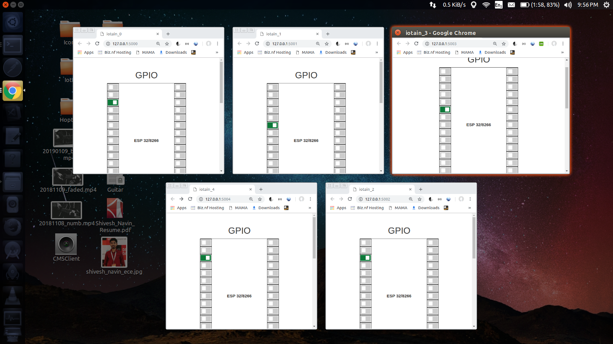
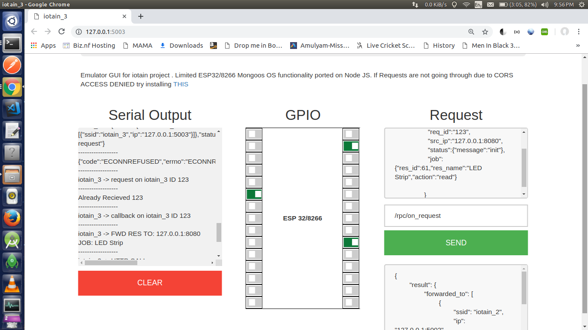

# iot_blockchain_exps
The project aims to support mongoose os mjs emulation on PC.

### Install
```shell
npm install --save mongoose-os-emulator
```
In your init.js file include the below line at the top.
```js
require('mongoose-os-emulator')();
```

### Run
```js
node init.js 0
```
Where 0 is your emulated device_id. The localhost port for the UI can be calculated as 
`5000 + device_id`. E.g. 
```
node init 1
http://127.0.0.1:5001
```

### Test

To Run on Windows

```code
double click run.bat
```

To run on Linux
```bash
./run.sh
```

To make a request 

run ota_server and send postman or from GUI request 
```json

http://127.0.0.1:5001/rpc/on_request

{
	
	"req_id":"123",
	"src_ip":"127.0.0.1:8080",
	"status":{"message":"under process"},
	"job":{"res_id":61,"res_name":"Ultrasound sensor","action":"read"}
	
}

```



  


### Limitations
Currently only these libraries are supported with limited scope. Feel free to add more features and raise a PR.

```js
 	this.Sys = load('api_sys.js');
    this.HTTP = load('api_http.js');
    this.RPC = load('api_rpc.js');
    this.Cfg = load('api_config.js');
    this.ffi = load('api_ffi.js');
    this.Event = load('api_events.js');
    this.Net = load('api_net.js');
    this.File = load('api_file.js');
    this.GPIO = ffi('gpio')
    this.Timer = load('api_timer.js');
    this.UART = load('api_uart.js');
```